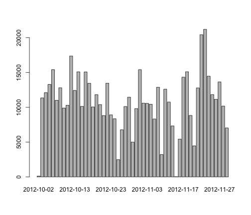

# Reproducible Research: Peer Assessment 1

Peer Assessment - 1
 
========================================================
### Loading and preprocessing the data 


```r
# 1. Load the data
setwd("~/R study projects/RepData_PeerAssessment1")
activityData <- read.csv("./activity.csv")
# 2. Process/transform the data (if necessary) into a format suitable for
# your analysis
NA
```

```
## [1] NA
```


### What is mean total number of steps taken per day?
**1. Make a histogram of the total number of steps taken each day**

```r
dailyStep <- aggregate(steps ~ date, data = activityData, FUN = sum, na.rm = TRUE)
dailyStepHist <- barplot(dailyStep[, "steps"], names.arg = dailyStep[, "date"])
```

 


**2. Calculate and report the *mean* and *median* total number of steps taken per day**
The mean of steps taken a day is

```r
mean(dailyStep[, "steps"])
```

```
## [1] 10766
```

The median of steps taken a day is

```r
median(dailyStep[, "steps"])
```

```
## [1] 10765
```


### What is the average daily activity pattern?

**1. Make a time series plot (i.e. `type = "l"`) of the 5-minute interval (x-axis) and the average number of steps taken, averaged across all days (y-axis)**

```r
intervalSteps <- aggregate(steps ~ interval, data = activityData, FUN = sum, 
    na.rm = TRUE)
# set up the plot
plot(intervalSteps[, "interval"], intervalSteps[, "steps"], type = "n", xlab = "interval", 
    ylab = "Steps taken")
lines(intervalSteps[, "interval"], intervalSteps[, "steps"], type = "l", lwd = 1.5)
```

 

**2. Which 5-minute interval, on average across all the days in the dataset, contains the maximum number of steps?**

```r
intervalSteps[intervalSteps$steps == max(intervalSteps$steps), ]
```

```
##     interval steps
## 104      835 10927
```


### Imputing missing values

**1. Calculate and report the total number of missing values in the dataset (i.e. the total number of rows with `NA`s)**
The total number of NA is

```r
length(activityData$steps[activityData$steps == "NA"])
```

```
## [1] 2304
```

**2. Devise a strategy for filling in all of the missing values in the dataset. The strategy does not need to be sophisticated. For example, you could use the mean/median for that day, or the mean for that 5-minute interval, etc.**

```r
summary(intervalSteps)
```

```
##     interval        steps      
##  Min.   :   0   Min.   :    0  
##  1st Qu.: 589   1st Qu.:  132  
##  Median :1178   Median : 1808  
##  Mean   :1178   Mean   : 1981  
##  3rd Qu.:1766   3rd Qu.: 2800  
##  Max.   :2355   Max.   :10927
```

```r
meanForNA <- mean(intervalSteps[, "steps"])
```

I rather use the mean for 5-minute interval to replace 'NA's

**3. Create a new dataset that is equal to the original dataset but with the missing data filled in.**


**4. Make a histogram of the total number of steps taken each day and Calculate and report the *mean* and *median* total number of steps taken per day. Do these values differ from the estimates from the first part of the assignment? What is the impact of imputing missing data on the estimates of the total daily number of steps?**


### Are there differences in activity patterns between weekdays and weekends?

For this part the `weekdays()` function may be of some help here. Use
the dataset with the filled-in missing values for this part.

**1. Create a new factor variable in the dataset with two levels -- "weekday" and "weekend" indicating whether a given date is a weekday or weekend day.**


**2. Make a panel plot containing a time series plot (i.e. `type = "l"`) of the 5-minute interval (x-axis) and the average number of steps taken, averaged across all weekday days or weekend days (y-axis).**


